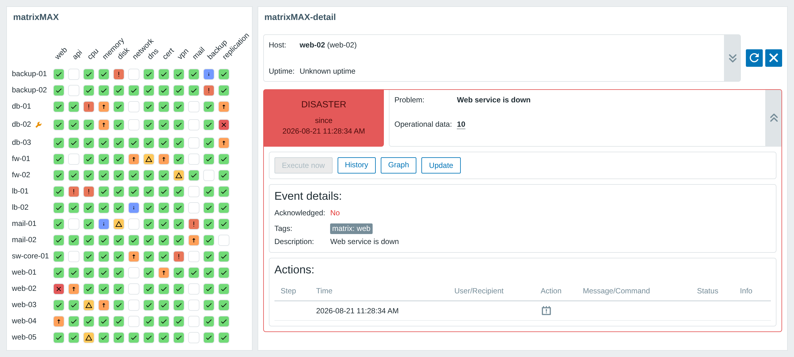
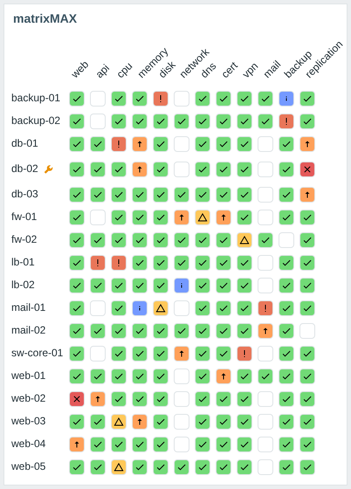
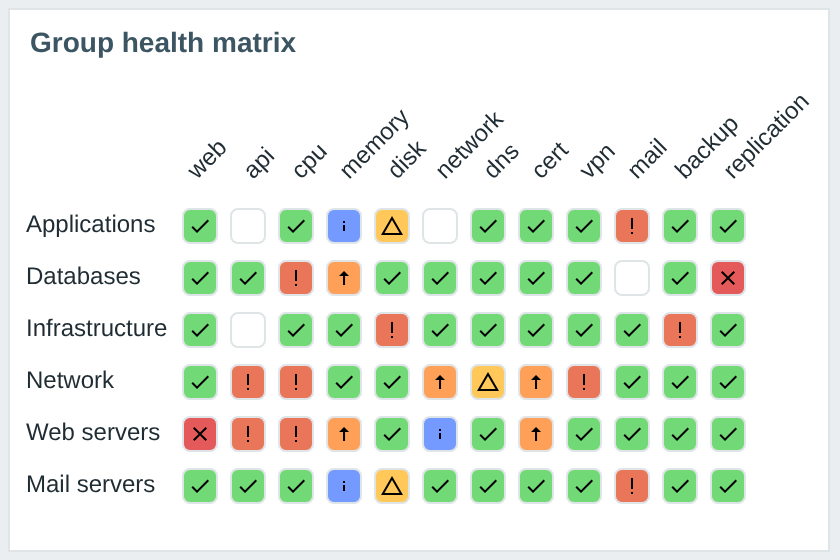
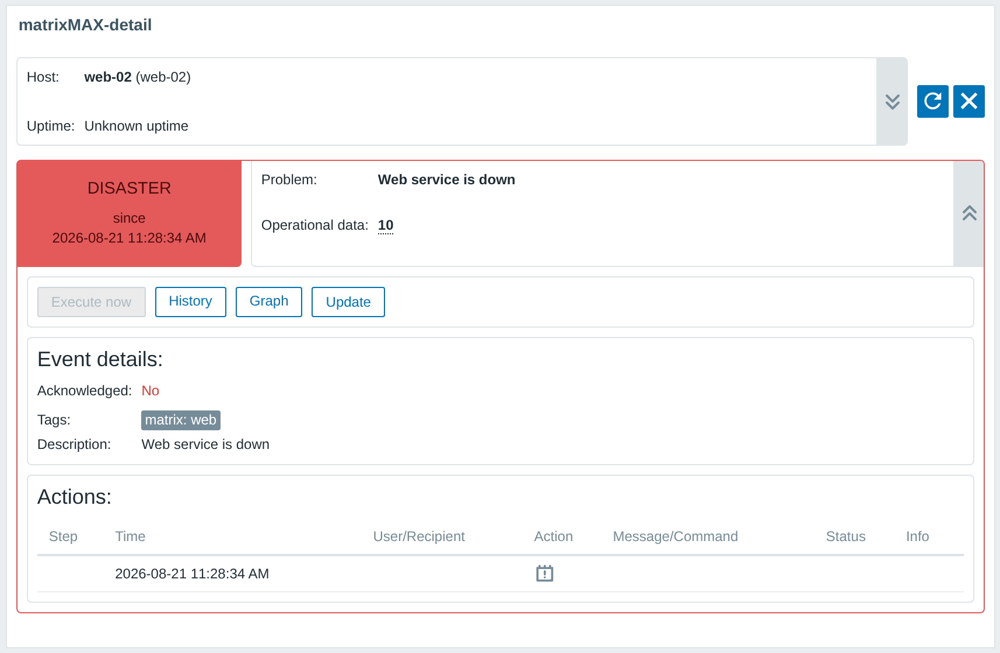
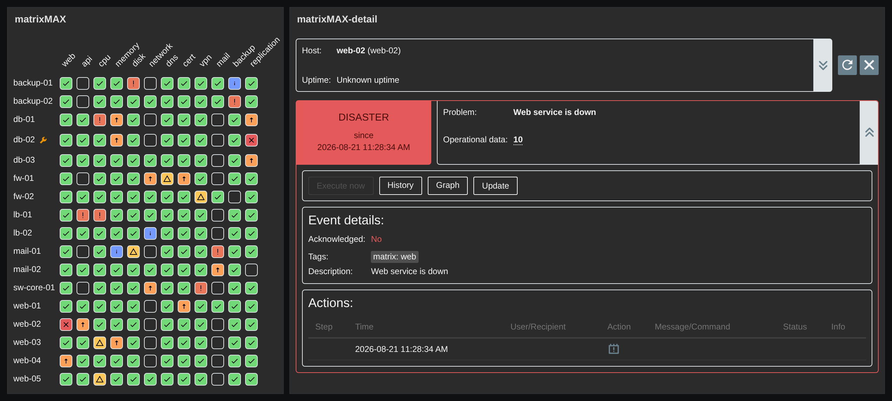
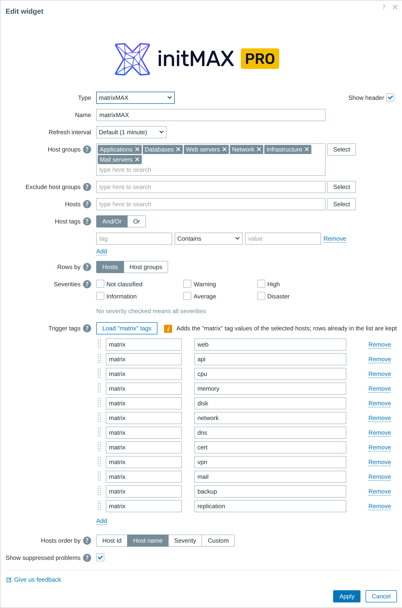
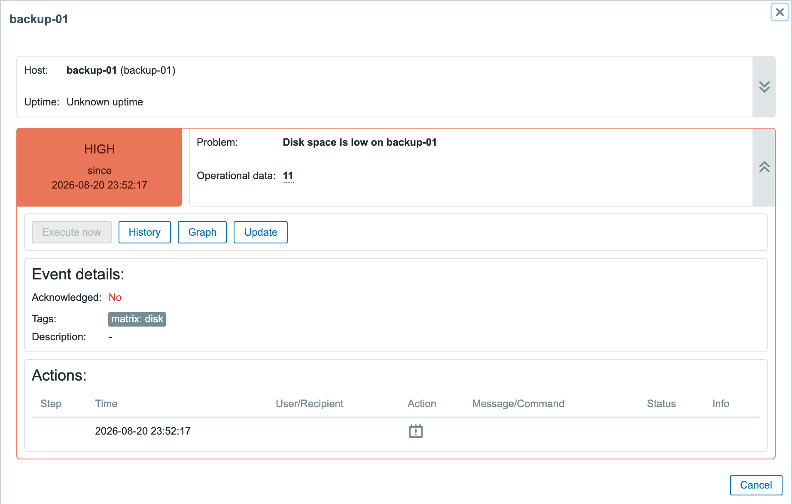
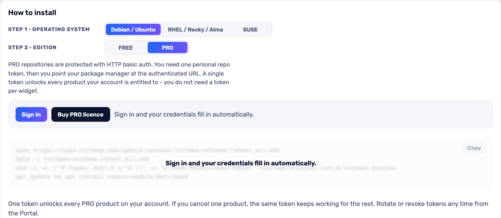

<h1>matrixMAX</h1>

developed and maintained by

and community

<strong>Every host, every check, one wall of colour - and one click for the detail.</strong> 
A problem list tells you what is broken. It does not tell you whether one host is having a bad day or one check is failing everywhere - so matrixMAX lays the same problems out as a grid: hosts down the side, checks across the top. Click a cell and the companion widget tells you what is behind it.

<a href="#what-you-can-build"><strong>Features</strong></a> &nbsp;·&nbsp;
<a href="#examples"><strong>Examples</strong></a> &nbsp;·&nbsp;
<a href="#install"><strong>Install</strong></a> &nbsp;·&nbsp;
<a href="#free-vs-pro"><strong>FREE vs PRO</strong></a> &nbsp;·&nbsp;
<a href="https://portal.initmax.com"><strong>Portal</strong></a> &nbsp;·&nbsp;
<a href="https://www.initmax.com/wiki/matrixmax/"><strong>Docs</strong></a>

 

---

## Why matrixMAX

Thirty problems in a list are thirty lines to read. The same thirty in a grid are a shape you recognise from across the room: a red ROW is one host in trouble, a red COLUMN is one check failing on everything, and a red block is the outage you are about to be paged for. **matrixMAX** builds that grid straight from your triggers - every column is one value of the `matrix` trigger tag, every row is one host - so the wall board that used to need a screenful of problem lists needs one tile.

## What you can build

<table>
<tr>
<td width="50%" valign="top">

**NOC wall boards**
A whole host group at a glance, sized so a full rack still fits on one screen.

</td>
<td width="50%" valign="top">

**Service readiness grids**
One column per check that has to pass before a service counts as up.

</td>
</tr>
<tr>
<td width="50%" valign="top">

**Per-customer views**
Filter by host group, exclude the groups you do not own, and one board serves one tenant.

</td>
<td width="50%" valign="top">

**Ordered by what hurts**
Sort rows by severity and the worst hosts float to the top on their own.

</td>
</tr>
<tr>
<td width="50%" valign="top">

**Your own row order**
Drag the hosts into the order the rack is actually wired in, and the board keeps it - the Load buttons only append, they never touch what you arranged.

</td>
<td width="50%" valign="top">

**A jumping-off point**
Right-click any cell or host for Zabbix's own menu - problems, history, the trigger, the items.

</td>
</tr>
<tr>
<td width="50%" valign="top">

**Fleet rollups**
Flip **Rows by** to host groups and a hundred hosts fold into a handful of rows - each cell carries the worst problem the whole group hides behind that column.

</td>
<td width="50%" valign="top">

**A board that survives upgrades**
Build the matrix and its detail tile on Zabbix 6.2 and upgrade to 7.0+ later - the pair keeps working with nothing to reconfigure.

</td>
</tr>
</table>

## Examples

<table>
<tr>
<td width="50%" align="center" valign="top"> <small><b>Hosts mode</b> - one row per host, every cell the highest open severity behind that check; a blank cell means no check, a wrench a host in maintenance</small></td>
<td width="50%" align="center" valign="top"> <small><b>Host groups mode</b> - hosts fold into their groups, a group cell shows the group's worst problem</small></td>
</tr>
<tr>
<td width="50%" align="center" valign="top"> <small><b>Cell detail</b> - the host, the trigger and its problem, event details and actions behind the clicked cell</small></td>
<td width="50%" align="center" valign="top"> <small><b>Dark theme</b> - the same board, severity cards and controls stay readable</small></td>
</tr>
</table>

## Configuration

One familiar widget form. Choose the **host groups** (and the ones to exclude), narrow further by host or host tag, then press **Load tags "matrix"** to fill the columns from the trigger tags your hosts actually carry, and **Load hosts** to fill the rows. Both loaders **append**: rows you typed or dragged keep their place and are never overwritten, and any tag name works as a column source - write your own tag and value straight into a row. Decide with **Rows by** whether a row is one host or a whole **host group** - a group cell shows the worst problem found on any of the group's hosts, and a host that belongs to two shown groups counts in both rows. Pick which **severities** count, decide whether **suppressed problems** show, and order the rows by host id, host name, severity - or drag them into your own order.

## Two widgets, one product

matrixMAX installs **two** Zabbix widgets from a single package:

| Widget | What it does | Zabbix |
| ------ | ------------ | ------ |
| **matrixMAX** | The grid itself - hosts down the side, trigger tags across the top | 6.0 - 7.4 |
| **matrixMAX-detail** | Put it beside the grid and point it at the matrix: click any cell and it shows that problem's severity, age, operational data, event details and host inventory | 6.0, 6.2 and 7.0 - 7.4 |

They are one purchase and one version, not two products - a grid you cannot drill into is half a feature. On 7.0+ the dashboard wires the pair together with Zabbix's own widget-to-widget communication. **6.0 and 6.2 predate that mechanism, so the package bridges it itself:** the same detail tile is registered there by the v1 module and the grid feeds it directly. You place and configure the pair exactly as on 7.4, and a dashboard built on 6.2 survives an in-place upgrade to 7.0+ with nothing to reconfigure - the native wiring simply takes over. Only 6.4 has no companion tile; there, and anywhere the companion is not placed on the dashboard, clicking a cell opens the same host, inventory, triggers, event details and actions as a dialog on top of the grid, with the same Update (acknowledge), Execute now, History and Graph controls. Same capability, one package - the frontend decides whether it lives in a second tile or in a popup.

 <small><b>The cell detail as a dialog</b> - on Zabbix 6.4, or on any version when no companion tile is placed: the same host card, trigger card, event details and actions, opened by a click on the cell.</small>

## Install

**PRO** ships as **GPG-signed `deb` / `rpm` packages** from the initMAX repository - `apt` / `dnf` installs them and keeps them updated.

### Easiest way - the guided installer on the Portal

Open the product page, pick your **OS** and **edition**, and copy the ready-made command. FREE is fully public (no login); PRO fills in your token once you sign in. There's a feedback box right there too.

<a href="https://portal.initmax.com/catalog/zabbix-matrixmax#how-to-install"><strong>→ Open the installer on the Portal</strong></a>

Prefer a plain archive? Every release also ships as a **ZIP**, downloadable from the portal once you sign in - handy for offline or manual installs.

The module is enabled automatically during the package installation - verify it in **Administration → General → Modules**. Done.

## FREE vs PRO

This product is sold as PRO - there is no FREE edition. Everything below is in the one package.

| Feature | PRO |
| ---------------------------------------------------------- | :----: |
| Problems of a host group as a hosts x trigger-tags grid | ✅ |
| Cells coloured by problem severity, with Zabbix's own severity palette | ✅ |
| Right-click a cell or a host for Zabbix's own context menu | ✅ |
| Columns and rows filled in from the hosts you selected | ✅ |
| Row order by host id, host name, severity or your own drag order | ✅ |
| Rows as hosts or folded into host groups, a group cell showing the group's worst problem | ✅ |
| Suppressed problems hidden or shown | ✅ |
| Cell detail - the problem, event, inventory and actions behind a cell: the matrixMAX-detail companion tile on 7.0+ and 6.0/6.2, a popup on 6.4 or with no companion placed | ✅ |
| One package for Zabbix 6.0 - 7.4 | ✅ |
| Localised into all Zabbix display languages | ✅ |
| High availability ready | ✅ |
| Licence | [Commercial](./LICENSE-PRO.md) |

## Requirements

|              |                                                              |
| ------------ | ------------------------------------------------------------ |
| **Zabbix**   | 6.0 · 6.2 · 6.4 · 7.0 · 7.2 · 7.4 - one package covers all    |
| **PHP**      | 7.4 or newer                                                 |
| **OS**       | Debian/Ubuntu · RHEL/Rocky/Alma/Oracle/Amazon · SUSE         |
| **Editions** | PRO (token-gated repo) - there is no free edition                  |
| **Data** | Triggers tagged `matrix:<column name>` - the tag values become the columns |
| **Widgets** | matrixMAX (6.0 - 7.4) · matrixMAX-detail (6.0, 6.2 and 7.0 - 7.4; on 6.4, or with no companion placed, the cell detail opens as a dialog) - both from one package |
| **Languages** | All 25 Zabbix display languages - the widget follows each user's own language setting |
| **High availability** | Ready. No server-side component and no local state; install it on every frontend node of an HA cluster and any node can serve it |

### Anything different on the older versions?

The grid, the colours, the context menus, both "Load ..." buttons, the row ordering, the host-group rows and the whole configuration dialog - same fields, same labels, same order - are identical on 6.0, 6.2, 6.4, 7.0, 7.2 and 7.4. One thing takes a different shape on one version, because that frontend cannot provide the mechanism behind it:

- **The cell detail on 6.4.** On 7.0+ the companion tile is fed by Zabbix's own widget-to-widget communication; on 6.0 and 6.2 the v1 module registers the same tile and the grid feeds it directly, so the pair works there too. 6.4 is the one frontend with neither path, and there - as on any version when no companion tile is placed - a click on a cell opens the detail as a dialog instead: the same host card, inventory, trigger cards, event details, actions and buttons. Everything the cell itself offers - its colour, its hint and its right-click menu into problems, history, the trigger and the items - works exactly as on 7.x.

A widget configured on any supported version keeps every setting when Zabbix is upgraded: the stored field names and values are identical across the whole range.

## Support &amp; links

- **[Documentation / Wiki](https://www.initmax.com/wiki/matrixmax/)**
- **[Product page](https://www.initmax.com/product/matrixmax/)**
- **[Portal](https://portal.initmax.com)** - downloads, tokens, support tickets
- **[support@initmax.com](mailto:support@initmax.com)**

---

PRO: <a href="./LICENSE-PRO.md">commercial</a> &nbsp;·&nbsp; © 2021-2026 initMAX s.r.o.

