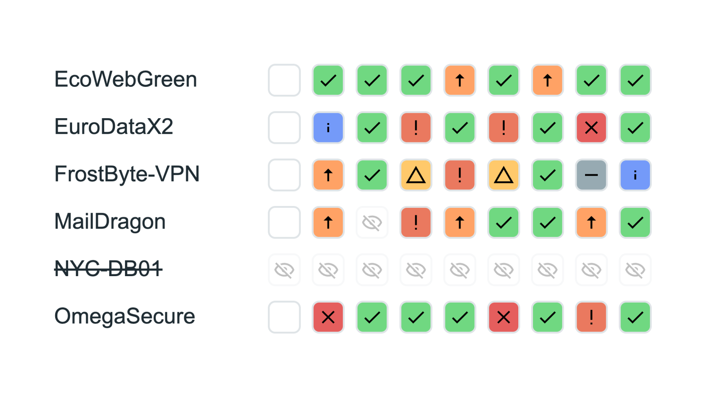

<div align=center>
    <h1>
        🔒 PRO Version Available
    </h1>
</div>

This is a **PRO-only** product. The full version with all features is available through initMAX PRO subscription.

For more information about initMAX PRO, please visit: [https://www.initmax.com/eshop/](https://www.initmax.com/eshop/)

---


<div align="center">
    <a href="http://www.initmax.com"></a>
    <h3>
        <span>
            Honesty, diligence and MAXimum knowledge of our products is our standard.
        </span>
    </h3>
    <h3>
        <a href="https://www.linkedin.com/company/initmax/">
            
        </a>&nbsp;&nbsp;&nbsp;
        <a href="https://www.youtube.com/@initmax1">
            
        </a>&nbsp;&nbsp;&nbsp;
        <a href="https://www.facebook.com/initmax">
            
        </a>&nbsp;&nbsp;&nbsp;
        <a href="https://www.instagram.com/initmax/">
            
        </a>&nbsp;&nbsp;&nbsp;
        <a href="https://x.com/initmax">
            
        </a>&nbsp;&nbsp;&nbsp;
        <a href="https://github.com/initmax">
            
        </a>
    </h3>
</div>
<br>

---
---

<br>
<br>

<div align="center">
    <h1>
        matrixMAX
    </h1>
    <h4><i>
        Clear matrix display of issues for host groups with tag-based visualization
    </i></h4>
    <br>
    
    
    <br><br>
    
</div>
<br>
<br>

## Description
A simple but powerful widget designed for clear matrix display of issues for specific host groups. matrixMAX can play a vital role in streamlined overview of your services or infrastructure. 

This package includes two widgets:
- **matrixMAX** - Main matrix widget for service status overview
- **matrixMAX-detail** - Companion widget for detailed problem information

The main visualization concept is based on tagging on trigger level in `key:value` format, with default tag `matrix:value` (customizable). Rows represent hosts, columns represent tagged services, and cells are color-coded by trigger severity.

## Key Features

### Matrix Visualization
- **Tag-Based Display**: Uses trigger tags in `matrix:value` format
- **Color-Coded Severity**: Cells colored by trigger severity levels
- **Host Rows**: Each row represents a host from selected host groups
- **Service Columns**: Columns represent tagged services/triggers
- **Disabled Hosts**: Crossed-through display for disabled hosts
- **Load Tags**: Automatic tag loading from triggers

### Configuration
- **Host Group Selection**: Choose one or multiple host groups
- **Host Group Exclusion**: Exclude specific host groups
- **Specific Hosts**: Select individual hosts
- **Severity Filtering**: Display only selected severity levels
- **Problem Tags**: Load tags automatically or specify manually
- **Host Ordering**: Sort by name, custom order, or manually rearrange
- **Suppressed Problems**: Option to show/hide suppressed problems

### Interactive Features
- **Left Click on Host**: Navigate to Monitoring → Problems with host filter
- **Left Click on Trigger**: Navigate to Monitoring → Problems with trigger tag filter
- **Right Click on Host**: Display Zabbix host menu
- **Right Click on Trigger**: Display Zabbix item menu

### Integration
- **matrixMAX-detail Widget**: Companion widget (included) showing detailed problem information when clicking triggers
- **inventoryMAX Module Support**: Can display custom inventory fields using `{INVENTORYMAX.*}` macros (if inventoryMAX module is installed separately)
- **Standard Inventory Fields**: Up to three inventory fields in matrixMAX-detail using `{INVENTORY.*}` macros

## matrixMAX-detail Widget
Companion widget included in this package. When configured alongside matrixMAX, displays:
- **Last Three Problems**: Recent problem history
- **Event Details**: Full event information
- **Action Log**: Event action history
- **Quick Access Menu**: Execute now, view history, view graphs
- **Event Updates**: Ability to update events directly
- **HTML Tables**: Converts HTML item data into tables
- **Uptime Display**: Shows uptime when item has `matrix:uptime` tag

## Optional: inventoryMAX Module Integration
matrixMAX and matrixMAX-detail can optionally integrate with the **inventoryMAX module** (separate component):
- **Custom Virtual Fields**: If inventoryMAX is installed, you can use custom fields beyond standard Zabbix inventory
- **Extended Macros**: Use `{INVENTORYMAX.*}` macros in addition to standard `{INVENTORY.*}` macros
- **Enhanced Filtering**: Filter hosts by custom fields when inventoryMAX module is available
- **Flexible Metadata**: Display custom structured host information in widget headers

> **Note**: inventoryMAX is a separate module and is not required for matrixMAX to function. matrixMAX works perfectly with standard Zabbix inventory fields.

### Use Cases
- **Service Monitoring**: Visual overview of services across infrastructure
- **NOC Dashboards**: Clear status display for operations centers
- **Multi-Service Hosts**: Monitor multiple services per host in matrix format
- **Quick Problem Identification**: Color-coded severity for instant recognition
- **Infrastructure Overview**: Streamlined view of host groups and their services

---

## 📋 Introduction

Zabbix as a robust monitoring system offers extensive functionality, but it often hits limitations in **service state visualization** and **managing supplementary host information**. That's why a solution consisting of three interconnected components was created:

- `matrixMAX` – service status overview matrix
- `matrixMAX-detail` – expandable detail at host and trigger level
- `inventoryMAX` – extension for managing custom inventory fields

### 📌 Purpose of the Solution

The goal is to provide operators, administrators, and consultants with a tool for:

- quick **problem identification across services and hosts**
- ability to **display detailed status** without leaving the dashboard
- management and **display of structured metadata** about hosts including custom attributes

---

## 📦 Component Overview

| Component            | Type    | Description                                                                    |
|----------------------|---------|--------------------------------------------------------------------------------|
| **matrixMAX**        | Widget  | Matrix displaying service states defined by trigger tags on hosts              |
| **matrixMAX-detail** | Widget  | Detailed view of service and host status after clicking in matrixMAX           |
| **inventoryMAX**     | Module  | Extension of Zabbix inventory with virtual fields and custom data management   |

---

## 📊 matrixMAX

### 📋 Description

`matrixMAX` is the main widget that displays the **status of defined services on individual hosts** in a clear matrix format. Each cell represents a combination of host and service (defined as a trigger tag) and allows quick orientation across infrastructure.

The main visualization concept is based on tagging on trigger level in `key:value` format, with default tag `matrix:value` (customizable). Rows represent hosts, columns represent tagged services, and cells are color-coded by trigger severity.

### 📐 Display Logic

- Hosts are in rows, services in columns
- Each cell corresponds to one trigger tag or group of tags on a host
- If multiple triggers share the same tag, the problem with the highest **severity** is displayed
- If a service is not defined for a host → field remains **empty**
- **Disabled trigger** → displayed as **eye icon**
- **Disabled host** → crossed-through name + eye icons in all row cells

### 🖱️ Controls

- **Left click on hostname** → opens Monitoring → Problems for that host
- **Left click on service name (column)** → opens Monitoring → Problems for that service (based on host groups in widget)
- **Left click on cell** → opens detail in `matrixMAX-detail`, if configured and linked
- **Right click** (on anything) → standard Zabbix context menu

### ⚙️ Configuration

#### 🔧 Prerequisites – Trigger Tag Preparation

Before configuring the widget, you must have **proper tags set on triggers (on hosts or in templates)** that will determine which "services" will be displayed in the matrix.

- For each monitored trigger, you need to define a **trigger tag** that will serve as a service identifier.
- **Tag can have any name and value**, but it's recommended to use the standard prefix `matrix` so that tags can be **automatically loaded** into the widget.
  - For example: `matrix: backup`, `matrix: uptime`, `matrix: service1`

> 🔁 Using a tag with the `matrix` prefix allows you to use **automatic loading of all relevant tags** when configuring the widget.

---

#### 🔧 Widget Configuration

1. **Basic Settings:**
   - Define widget type and name
   - Set refresh interval

2. **Host and Severity Selection:**
   - Select host groups
   - Define excluded host groups
   - Select individual hosts (optional)
   - Set required severity levels (Warning, High, Disaster, etc.)

3. **Trigger Tag Configuration** (services in matrix):
   - **Manually** – add `name` and `value` of the tag
     - Tag value will be used as column name (= service)
   - **Automatically** – loads all tags in the format `matrix:*` for selected hosts  
     ⚠️ With automatic loading, the **entire existing tag list will be overwritten**

4. **Host Ordering:**
   - By `hostid` (default)
   - Alphabetically by name
   - By total host severity (sum: OK = 1 to Disaster = 6)
   - Custom order – using drag & drop after loading hosts

5. **Additional Options:**
   - Checkbox: **Show suppressed problems**

5. **Additional Options:**
   - Checkbox: **Show suppressed problems**

---

## 📊 matrixMAX-detail

### 📋 Description

`matrixMAX-detail` is a supplementary widget used for **detailed display of host and service status** that the user clicked on in the `matrixMAX` matrix.

It is divided into two main sections:

1. Host information
2. Trigger/problem information

### 📐 Widget Sections

#### 1. Host Information

- **Hostname** and **Visible name**
- **IP/DNS**
- **Interface status**
- **Uptime**
  - Displays current host uptime
  - Defined using **item tag** `matrix: uptime`, which specifies which item on the host records uptime data
- **Up to 3 inventory fields**, displayed directly in the header
- Additional inventory fields are displayable in a drop-down list via the expandable menu icon

#### 2. Service Information

- Problem name + status and severity
- Problem occurrence time
- **Operational data**:
  - By default, the last value from the database is displayed
  - **Extended functionality**: If the value is in `HTML <table>` format, a button to visualize it as a formatted table is automatically displayed
  - This function also processes other HTML tags inside the table, allowing structured data to be displayed directly in the detail without needing to switch to other Zabbix sections
  - **Use case example**: Ideal for displaying complex data from database queries or scripts that return tabular outputs with multiple columns and rows (e.g., active connection overview, service status, parameter configuration)

- **Possible Actions**:
  - `Execute now`
  - `History`
  - `Graph` (for numeric values)
  - `Update`
    - `Acknowledge`
    - `Suppress`
    - `Change severity`
    - `Close problem`
  - Information about **event** and its **tags**
  - Action history (event history)

### 🖱️ Interaction

- Close detail using **X button**
- Ability to **refresh only this detail**, without reloading the entire dashboard

### ⚙️ Configuration

1. **Basic Settings:**
   - Define widget type and name
   - Set refresh interval

2. **Link with matrixMAX:**
   - Determine for which `matrixMAX` widgets this detail will serve as a supplement
   - Multiple widgets are supported (standard Zabbix logic)

3. **Inventory Fields:**
   - Definition using `{INVENTORY.*}` (Zabbix built-in)
   - `{INVENTORYMAX.*}` can also be used if `inventoryMAX` module is installed

---

## 📊 inventoryMAX

### 📋 Description

`inventoryMAX` is an **extension module for Zabbix inventory** that addresses fundamental limitations of Zabbix native functionality in host metadata management.

While Zabbix allows the use of built-in inventory fields (e.g., "Asset tag", "Location", "Contact person"…), there are issues:

- fields are fixed and cannot be extended with custom attributes,
- there's no way to conveniently manage multiple structural data without bypassing the system,
- there's no support for advanced filtering or display of custom fields in the GUI.

➡️ `inventoryMAX` fills this gap by allowing users to define and organize **custom virtual fields** within a single Zabbix inventory field – `INVENTORY.NOTES`.

---

### 📌 Why It Was Created

Zabbix natively does not allow:

- defining custom fields outside the predefined list,
- group filtering by custom attributes,
- adding structured data entities (e.g., CMDB ID, customer number, service owner).

The solution is to store multiple values in one field in **JSON** format – this allows any number of key-value pairs to be encapsulated in `Notes`.

> 🔐 inventoryMAX also prevents direct overwriting of the `Notes` field in the GUI, thereby maintaining the integrity of structured data.

---

### 💾 Structure and Data Handling

All data is stored in one `Notes` field in JSON format, e.g.:

```json
{
  "Asset Tag": "AT-0123",
  "CMDB ID": "10234"
}
```

- This format allows easy extension with additional values without disrupting existing data and without needing to create another data repository for this data.
- Values are readable and understandable even outside Zabbix, e.g., during export or backup.
- The `Notes` field database limit is 65,536 characters.

---

### 🔄 Automation and API

Currently, inventoryMAX **does not provide its own API**. Data can only be written using **Zabbix standard API for host inventory modification**, e.g., via `host.update`.

This means:

- the application must load the entire JSON from `Notes`,
- make modifications (e.g., add/change one field),
- write back the **entire JSON** (including all other values).

> 📌 inventoryMAX is therefore currently optimized for **manual data management** or **automation using custom tools** that can work with the entire JSON object.

---

### ⚙️ Configuration

Configuration is done in the menu `Administration → inventoryMAX fields config`

#### 🔧 Fields Tab

- Allows defining custom fields:
  - Field `Name` (displayed name)
  - Field `Type` (String / Numeric)
  - `Description` of what the field should contain
- Each field gets its own macro `{INVENTORYMAX.FIELD}`, which can be used in other widgets

#### 🔧 List columns Tab

- Defines the overview of displayed columns in the GUI (`Inventory → inventoryMAX`)
  - `Label` – column name
  - `Column` – data source (`{INVENTORY.*}` or `{INVENTORYMAX.*}`)

---

### 📈 Display and Filtering

- Clear table of all hosts in section `Inventory → inventoryMAX`
- Ability to filter by:
  - host name
  - host group
  - host tags
  - custom virtual fields
- Values can also be displayed in other widgets, e.g., in the `matrixMAX-detail` header

---

## 🔗 Integration Between Components

- `matrixMAX` → main widget for status overview
- `matrixMAX-detail` → supplement activated by clicking in the matrix
- `inventoryMAX` → source for custom data used e.g., in detail header

---

## 📚 Use Cases
---

## 📚 Use Cases

- **Service Monitoring**: Visual overview of services across infrastructure
- **NOC Dashboards**: Clear status display for operations centers
- **Multi-Service Hosts**: Monitor multiple services per host in matrix format
- **Quick Problem Identification**: Color-coded severity for instant recognition
- **Infrastructure Overview**: Streamlined view of host groups and their services
- **Custom Metadata Management**: Store and display structured host information beyond standard inventory fields
- **Integrated Problem Details**: Access comprehensive problem information without leaving the dashboard

<br><br>
<div align="center">
    <a href="https://www.initmax.com/wiki/matrixmax/">
        <br>
        <b>Documentation</b><br>
        
    </a>
</div>
<br>
<br>

---
---

<br>
<div align="center">
    <a href="https://www.initmax.com/">
         initMAX.com
    </a>&nbsp;&nbsp;&nbsp;
    <a href="tel:+420800244442">
         +420800244442
    </a>&nbsp;&nbsp;&nbsp;
    <a href="mailto:info@initmax.com">
         info@initmax.com
    </a>
    <br><br><br>
    <a href="https://www.linkedin.com/company/initmax/">
        
    </a>&nbsp;
    <a href="https://www.youtube.com/@initmax1">
        
    </a>&nbsp;
    <a href="https://www.facebook.com/initmax">
        
    </a>&nbsp;
    <a href="https://www.instagram.com/initmax/">
        
    </a>&nbsp;
    <a href="https://x.com/initmax">
        
    </a>&nbsp;
    <a href="https://github.com/initmax">
        
    </a><br><br><br>
    <a></a>&nbsp;&nbsp;&nbsp;
    <a></a>
    <br><br><br>
    <a>
        
    </a>
</div>