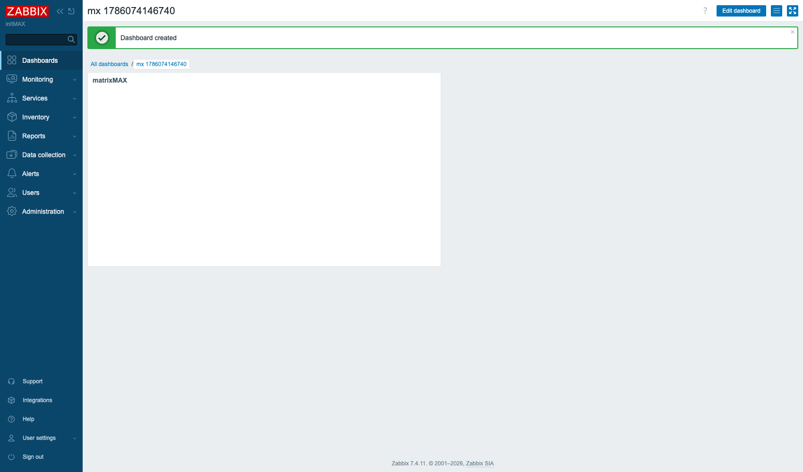
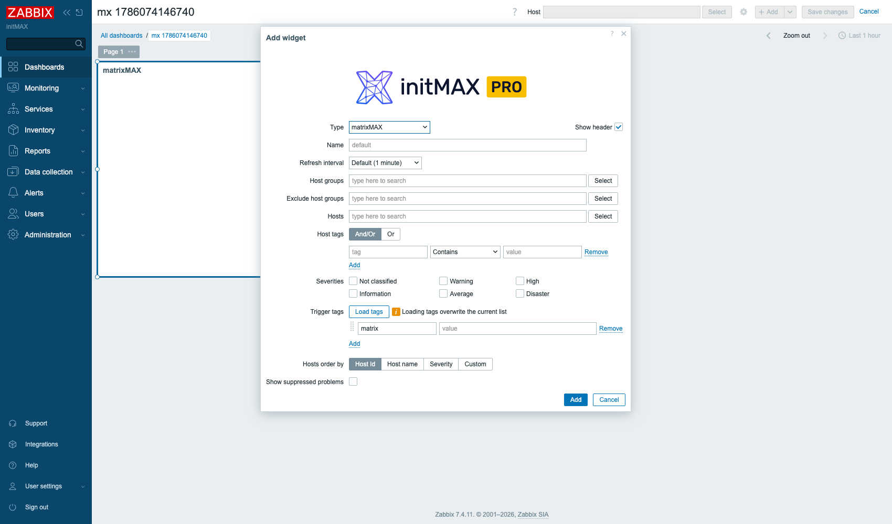

<h1>matrixMAX</h1>

developed and maintained by

and community

<strong>Every host, every check, one wall of colour - and one click for the detail.</strong> 
A problem list tells you what is broken. It does not tell you whether one host is having a bad day or one check is failing everywhere - so matrixMAX lays the same problems out as a grid: hosts down the side, checks across the top. Click a cell and the companion widget tells you what is behind it.

<a href="#what-you-can-build"><strong>Features</strong></a> &nbsp;·&nbsp;
<a href="#examples"><strong>Examples</strong></a> &nbsp;·&nbsp;
<a href="#install"><strong>Install</strong></a> &nbsp;·&nbsp;
<a href="#free-vs-pro"><strong>FREE vs PRO</strong></a> &nbsp;·&nbsp;
<a href="https://portal.initmax.com"><strong>Portal</strong></a> &nbsp;·&nbsp;
<a href="https://www.initmax.com/wiki/matrixmax/"><strong>Docs</strong></a>

 

---

## Why matrixMAX

Thirty problems in a list are thirty lines to read. The same thirty in a grid are a shape you recognise from across the room: a red ROW is one host in trouble, a red COLUMN is one check failing on everything, and a red block is the outage you are about to be paged for. **matrixMAX** builds that grid straight from your triggers - every column is one value of the `matrix` trigger tag, every row is one host - so the wall board that used to need a screenful of problem lists needs one tile.

## What you can build

<table>
<tr>
<td width="50%" valign="top">

**NOC wall boards**
A whole host group at a glance, sized so a full rack still fits on one screen.

</td>
<td width="50%" valign="top">

**Service readiness grids**
One column per check that has to pass before a service counts as up.

</td>
</tr>
<tr>
<td width="50%" valign="top">

**Per-customer views**
Filter by host group, exclude the groups you do not own, and one board serves one tenant.

</td>
<td width="50%" valign="top">

**Ordered by what hurts**
Sort rows by severity and the worst hosts float to the top on their own.

</td>
</tr>
<tr>
<td width="50%" valign="top">

**Your own row order**
Drag the hosts into the order the rack is actually wired in, and the board keeps it.

</td>
<td width="50%" valign="top">

**A jumping-off point**
Right-click any cell or host for Zabbix's own menu - problems, history, the trigger, the items.

</td>
</tr>
</table>

## Examples

<table>
<tr>
<td width="50%" align="center" valign="top"> <small><b>The grid</b> - a row of red is a host, a column of red is a check</small></td>
<td width="50%" align="center" valign="top"> <small><b>Configuration</b> - the same form on every supported version</small></td>
</tr>
</table>

## Two widgets, one product

matrixMAX installs **two** Zabbix widgets from a single package:

| Widget | What it does | Zabbix |
| ------ | ------------ | ------ |
| **matrixMAX** | The grid itself - hosts down the side, trigger tags across the top | 6.0 - 7.4 |
| **matrixMAX-detail** | Put it beside the grid and point it at the matrix: click any cell and it shows that problem's severity, age, operational data, event details and host inventory | 7.0 - 7.4 |

They are one purchase and one version, not two products - a grid you cannot drill into is half a feature. The **detail widget needs Zabbix 7.0** because that is the release where Zabbix gained widget-to-widget communication; on 6.0, 6.2 and 6.4 a dashboard has no way to wire one widget's selection into another's, so the package does not install it there at all rather than leaving a tile that can never receive anything. The grid works fully on those versions on its own.

## Configuration

One familiar widget form. Choose the **host groups** (and the ones to exclude), narrow further by host or host tag, then press **Load tags** to fill the columns from the `matrix` trigger tags your hosts actually carry, and **Load hosts** to fill the rows. Pick which **severities** count, decide whether **suppressed problems** show, and order the rows by host id, host name, severity - or drag them into your own order.

## Install

Both **FREE** and **PRO** ship as **GPG-signed `deb` / `rpm` packages** from the initMAX repository - `apt` / `dnf` installs them and keeps them updated. Same flow for both editions; PRO just adds your personal repo token.

### Easiest way - the guided installer on the Portal

Open the product page, pick your **OS** and **edition**, and copy the ready-made command. FREE is fully public (no login); PRO fills in your token once you sign in. There's a feedback box right there too.

<a href="https://portal.initmax.com/catalog/zabbix-matrixmax#how-to-install"><strong>→ Open the installer on the Portal</strong></a>

Prefer a plain archive? Every release also ships as a **ZIP** - FREE [straight from the repo](https://repo.initmax.com/zabbix/free/zip/matrixmax/), PRO with your repo token - handy for offline or manual installs.

Then enable it in **Administration → General → Modules**. Done.

## FREE vs PRO

| Feature                                                                    |  FREE  |  PRO   |
| -------------------------------------------------------------------------- | :----: | :----: |
| Problems of a host group as a hosts x trigger-tags grid                    |   ✅   |   ✅   |
| Cells coloured by problem severity, with Zabbix's own severity palette     |   ✅   |   ✅   |
| Right-click a cell or a host for Zabbix's own context menu                 |   ✅   |   ✅   |
| Columns and rows filled in from the hosts you selected                     |   ✅   |   ✅   |
| Row order by host id, host name, severity or your own drag order           |   ✅   |   ✅   |
| Suppressed problems hidden or shown                                        |   ✅   |   ✅   |
| matrixMAX-detail: the clicked cell's problem, event and inventory (Zabbix 7.0+) |   ✅   |   ✅   |
| One package for Zabbix 6.0 - 7.4                                           |   ✅   |   ✅   |
| Localised into all Zabbix display languages                                |   ✅   |   ✅   |
| High availability ready                                                    |   ✅   |   ✅   |
| Licence                                                                    | AGPLv3 | [Commercial](./LICENSE-PRO.md) |

matrixMAX has no paid-only capability, so there is nothing greyed out and nothing to unlock: the FREE and PRO packages are the same widget, and the table above ticks both columns on every row because that is the truth rather than a courtesy.

## Requirements

|              |                                                              |
| ------------ | ------------------------------------------------------------ |
| **Zabbix**   | 6.0 · 6.2 · 6.4 · 7.0 · 7.2 · 7.4 - one package covers all   |
| **PHP**      | 7.4 or newer                                                 |
| **OS**       | Debian/Ubuntu · RHEL/Rocky/Alma/Oracle/Amazon · SUSE         |
| **Editions** | FREE (public repo) · PRO (token-gated repo)                  |
| **Languages** | All Zabbix display languages - the widget follows each user's own language setting |
| **High availability** | Ready. No server-side component and no local state; install it on every frontend node of an HA cluster and any node can serve it |
| **Data**     | Triggers tagged `matrix:<column name>` - the tag values become the columns |
| **Widgets**  | matrixMAX (6.0 - 7.4) · matrixMAX-detail (7.0 - 7.4) - both from one package |

### Anything different on the older versions?

The grid, the colours, the context menus, both "Load ..." buttons, the row ordering and the whole configuration dialog - same fields, same labels, same order - are identical on 6.0, 6.2, 6.4, 7.0, 7.2 and 7.4. One thing is deliberately absent below 7.0, because those frontends genuinely cannot provide it:

- **The matrixMAX-detail widget, and with it the click-a-cell-to-drill-in flow.** Zabbix gained widget-to-widget communication in 7.0; before that a dashboard has no way to wire one widget's selection into another's filter. So on 6.0, 6.2 and 6.4 the package installs the grid only, and a cell is not a broadcast source. Everything the cell itself offers - its colour, its hint and its right-click menu into problems, history, the trigger and the items - works exactly as on 7.x.

A widget configured on any supported version keeps every setting when Zabbix is upgraded: the stored field names and values are identical across the whole range.

## Support &amp; links

- 📚 **[Documentation / Wiki](https://www.initmax.com/wiki/matrixmax/)**
- 🛒 **[Product page](https://www.initmax.com/product/matrixmax/)**
- 🎫 **[Portal](https://portal.initmax.com)** - downloads, tokens, support tickets
- 💾 **Source code** (FREE, AGPLv3) - included in every package and published as a [source archive](https://repo.initmax.com/zabbix/free/zip/matrixmax/) on repo.initmax.com
- ✉️ **[support@initmax.com](mailto:support@initmax.com)**

---

FREE: <a href="https://www.gnu.org/licenses/agpl-3.0.html">AGPLv3</a> &nbsp;·&nbsp; PRO: <a href="./LICENSE-PRO.md">commercial</a> &nbsp;·&nbsp; © 2021-2026 initMAX s.r.o.

